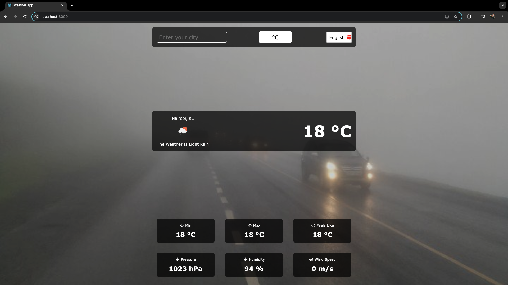
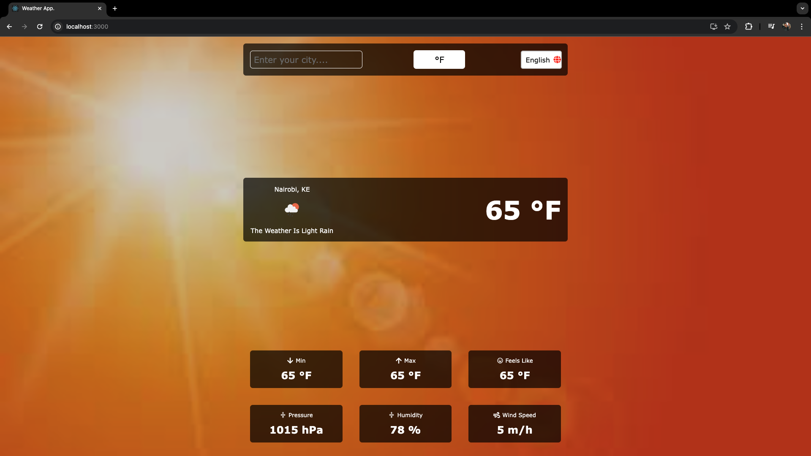
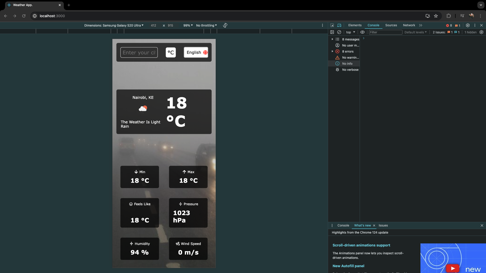
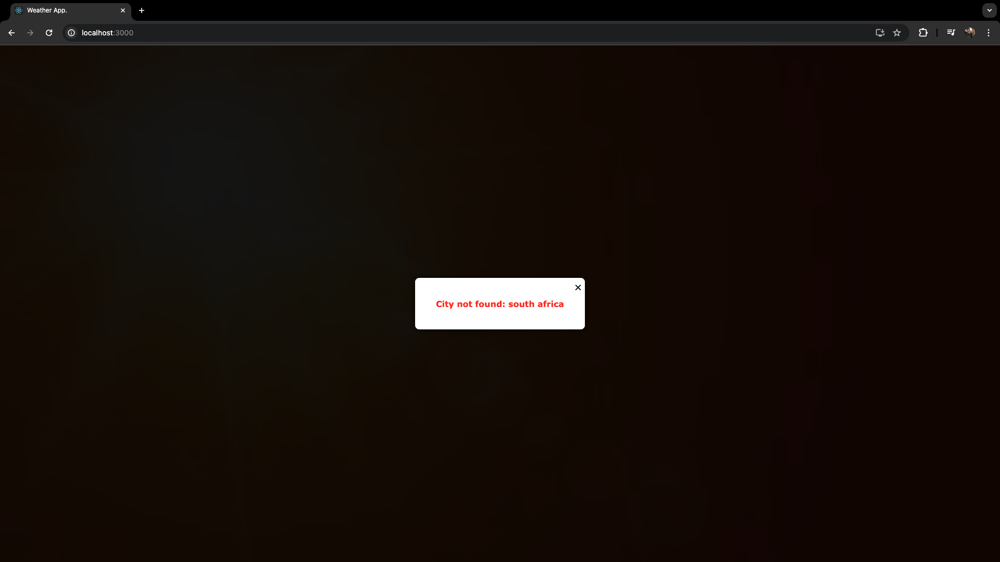

# Multilingual Weather Dashboard

This is a simple multilingual weather dashboard built using React. It allows users to view current weather data for Nairobi in both English and Swahili languages.
Bonus- default city set to  Nairobi, but other cities still searchable.

## Features

- Multilingual UI: Supports English and Swahili languages.
- Multi-units - for Celsius and Fahrenheit
- Weather Display: Fetches and displays current weather data from the OpenWeatherMap API for Nairobi.
- State Management: Utilizes React's context API for managing weather data and language settings.
- Styling and Responsiveness: Well-styled and responsive design for usability on both mobile and desktop devices.
- Also added some smooth animation for loading the cards.

## Getting Started

### Prerequisites

- Node.js installed on your machine
- An API key from OpenWeatherMap (sign up at [OpenWeatherMap](https://openweathermap.org/) and get your API key)

### Installation

1. Clone the repository:

   ```bash
   git clone https://github.com/daniel-mawioo/multilingual-weather-dashboard.git
   ```

2. Navigate to the project directory:

   ```bash
   cd multilingual-weather-dashboard
   ```

3. Install dependencies:

   ```bash
   npm install
   ```

4. Create a `.env` file in the root directory and add your OpenWeatherMap API key:

   ```
   REACT_APP_API_KEY=your-api-key-here
   ```

### Usage

1. Start the development server:

   ```bash
   npm start
   ```

2. Open your browser and navigate to `http://localhost:3000` to view the dashboard.

### Language Switcher

- Toggle between English and Swahili languages using the language switcher provided in the UI.

## Built With

- [React](https://reactjs.org/) - JavaScript library for building user interfaces
- [react-intl](https://github.com/formatjs/react-intl) - Internationalize React apps
- [OpenWeatherMap API](https://openweathermap.org/api) - Weather data API


# Navigating the App.
1.Landing page

## Home


### Hot and cold weather showing a dynamic background as on the screenshots below.
- Temp below 20 is cold and vice versa

_Below are some screenshots of screens from the running application:_
| Cold temperatures below 20      |  Hot Weather above 20 | Mobile Screen Responsive| Error handling Screen |
| ----------- | ----------- | ----------- | ----------- |
|  | |  |  |


## Authors

- [Daniel mawioo](https://github.com/daniel-mawioo)
